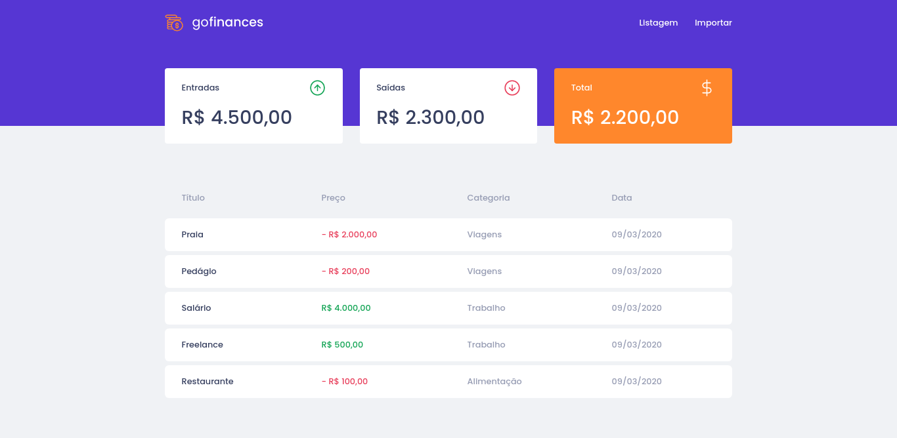
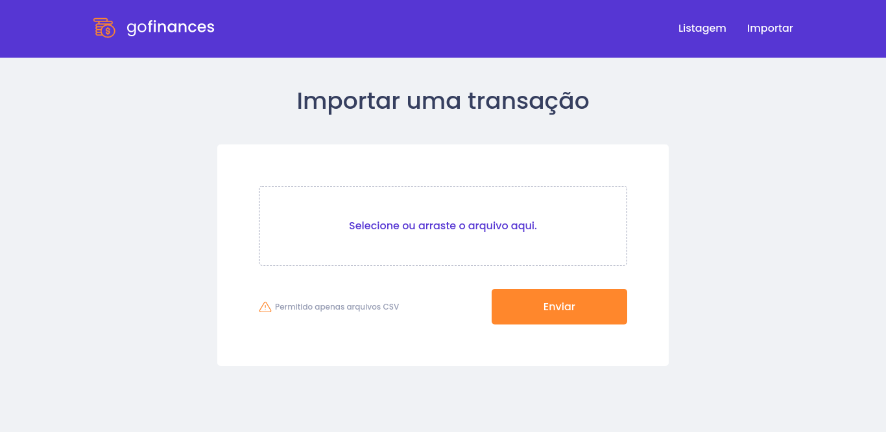

# Go Finances

<br/>

<p align="center">
  <a href="#about-project">About project</a>&nbsp;&nbsp;&nbsp;|&nbsp;&nbsp;&nbsp;
  <a href="#pages">Pages</a>&nbsp;&nbsp;&nbsp;|&nbsp;&nbsp;&nbsp;
  <a href="#technologies">Technologies</a>&nbsp;&nbsp;&nbsp;|&nbsp;&nbsp;&nbsp;
  <a href="#getting-started">Getting started</a>&nbsp;&nbsp;&nbsp;&nbsp;&nbsp;&nbsp;
</p>

<br/>

<h1 align="center">
  
</h1>

<br/>

## About project

Application created to mananger financial transactions. </br>
It lists all the transactions the user made. Each transaction displays the name, price, category and the date. </br>
At the top of the page, it shows the total income, outcome and the balance. </br>
</br>
The application has a drag-n-drop component, which is able to import data from a CSV file. 

---

<br/>

## Pages

  ### Import Page
  
  
---  

<br/>

## Technologies

[TypeScript](https://www.typescriptlang.org/)

### Back-end:

- [Node.js](https://nodejs.org/en/), 
- [PostgreSQL](https://www.postgresql.org/), 
- [Docker](https://www.docker.com/)


### Web:

- [ReactJS](https://reactjs.org/), 
 
---

<br/>

## Getting started


### Requirements

- [Node.js](https://nodejs.org/en/)
- [Yarn](https://classic.yarnpkg.com/)
- [Expo](https://expo.io/)
- [Docker](https://www.docker.com/)

**Install dependencies**

```sh
$ yarn
```


### Backend

```sh
$ yarn dev:server
```

### Web

```sh
$ yarn start
Start client, be sure if server (backend) is running
```
